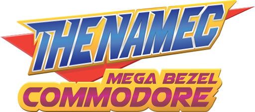

THENAMEC MEGA BEZEL : COMMODORE
==============================
  
All-in-one overlays and preset pack for **Libretro RetroArch** and **HSM Mega Bezel Reflection Shader**.  

Official Links:  
- *RetrogamingPacks Blog* <https://retrogamingpacks.blogspot.com>  
- *Libretro thread* <https://forums.libretro.com/t/31523>  
- *Facebook Page* <https://www.facebook.com/retrogamingpacks>  
- *YouTube Channel* <https://www.youtube.com/channel/UCnnDp1jwiNvSPlzzu2fW6vw>  
- *E-mail* <thenamec@hotmail.com>  

Latest releases:
- *Blog downloads* (https://retrogamingpacks.blogspot.com/p/downloads.html)  
- *GitHub Repository* <https://github.com/TheNamec/megabezel-commodore-pack/releases>

> Documentation revision  
> *October 2nd, 2022 - Release Candidate 4*

# Change Log

## Mega Bezel Commodore Pack RC4 (October 2nd, 2022)
----------------------------------------

New release for public testing, complete overhaul of pixel shader chain based off the new `MEGAREFERENCE SYSTEM`. This enables for complex modular shaders mixing CRT masking, color correction, cables/signal, aspect ratios and my own variations called `NMC SPICED FLAVOURS`.

Minimum software requirements:
- [**RetroArch v1.11.0**](https://www.retroarch.com/?page=platforms)
- [**HSM Mega Bezel V_1.4.2_2022-09-27**](https://github.com/HyperspaceMadness/Mega_Bezel/releases)

Content:
- Added `COMMODORE AMIGA CDTV` scene
- Added `RETROWALLS DARKSTUCCO` scene
- Added `RETROWALLS NEONSMOKE` scene
- Added `NMC SPICED FLAVOURS SHARP` presets: RGB, S-VIDEO, SMOOTH SCALEFX
- Added `NMC SPICED FLAVOURS SOFT` presets: COMPOSITE, RGB, RGB SMOOTH, SMOOTH SUPER-XBR, UPSCALE DREZ 480p, MONOCHROME, VECTOR, WORN-OUT
- Added `MBZ VANILLA FLAVOURS SHARP` presets: ADVANCED, LCD-GRID, POTATO, SMOOTH ADV, STANDARD
- Added `MBZ VANILLA FLAVOURS SOFT` presets: NTSC ADVANCED, NTSC POTATO, NTSC SMOOTH ADV, NTSC STANDARD
- Updated `PHILIPS 21PT3326-V7` with "fake flat" cabinet glass reflection
- Updated `README` with tech insights, quick start procedures and customization guides

Features:
- Added `MEGAREFERENCE SYSTEM` to enable advanced visual customization
- Added `SHADER CONNECTORS` to base vanilla Mega Bezel shaders
- Added `FLUIDVISION` for responsive textured displays
- Added `CRT-MASK VISUAL LAYER` to mimic original displays visual behavior
- Added `SIGNAL/CONNECTION VISUAL LAYER` to influence visual clarity with special effects
- Added `COLOR-CORRECTION VISUAL LAYER` to simulate real life CRTs colors
- Added `SCENE LIGHTNING VISUAL LAYER` for advanced and vanilla day/night ambient lightning
- Added `DEVICE LIGHTNING VISUAL LAYER` for advanced cabinet glass, tube diffuse, tube reflection static and tube shadow effects
- Added `GLOBAL OVERRIDE SETTINGS` for users to toggle modular shaders (at their own peril!)

Enhancements:
- Added `CRT-ASPECT-RATIO AUTO` for automatic aspect ratio detection
- Added `CRT-ASPECT-RATIO EXPLICIT 1.33` for forced 4:3 aspect ratio
- Added `CRT-ASPECT-RATIO PIXEL ASPECT RATIO` for core based pixel aspect ratio
- Added `CRT-CABLES COMPONENT/RGB/SCART` for best quality connection, sharp and crisp image
- Added `CRT-CABLES S-VIDEO` for top quality connection, clean image
- Added `CRT-CABLES COMPOSITE` for standard quality connection, some noise
- Added `CRT-CABLES RF-MODULATOR` for bad quality connection, hum-bar and noise
- Added `CRT-COLOR-CORRECTION TEMPERATURE` with cold (9300k) and warm (6800k) presets
- Added `CRT-COLOR-CORRECTION MONOCHROME` with amber, aqua, black&white, blood and green presets
- Added `CRT-MASK APERTURE-GRILLE BASE` for "-tron" family displays
- Added `CRT-MASK PLASMA` for monochrome display visuals
- Added `CRT-MASK SHADOW-MASK PRO` for generic dot-triad professional displays visuals
- Added `CRT-MASK SLOT-MASK CONSUMER` for generic consumer TV visuals
- Added `CURVED FAUX bezel` presets for curved bezels on a flat screen

Fixes:
- Updated `MEGA BEZEL REFLECTION SHADER` presets parameters to latest public MBR shader version
- Fixed `FILENAME CASING CONVENTION` for Linux users
- Renamed `NORMAL SCALING` to `FULL DEVICE SCALING`

## Mega Bezel Commodore Pack RC3.1 (May 1st, 2022)
----------------------------------------

New release for public testing, added a new pixel shader chain to customize displays CRT visuals.
BONUS: squashed some minor visual bug.

Software requirements:
- [**RetroArch v1.9.8**](https://www.retroarch.com/?page=platforms) with aspect ratio set to ‘full’
- [**HSM_Bezel_Reflection_V_0.9.106_2022-03-24_Rev_1**](https://forums.libretro.com/t/hsm-mega-bezel-reflection-shader-feedback-and-updates)

Features:
- Added `CRT-TECH CHAIN` to get pixel shaders customization according to actual IRL display technology

Enhancements:
- Added `CRT-TECH SLOT-MASK COMMODORE` for Commodore displays visuals (based off CRT-A2080-HiResSmartResShader by Guest.R & Rincewind) 
- Added `CRT-TECH APERTURE-GRILLE SHARP` for procedural bezels visuals (based off Death-to-Pixels by Cyber)

Fixes:
- Fixed `SCALE PRESETS` for better visual coherence across curved, flat and integer (tnx Ryusan)
- Fixed `SCENE PRESETS` to fix tube reflections texture (tnx HyperSpaceMadness)
- Fixed `GITHUB REPO STRUCTURE` to ease out the updating process for advanced users (tnx HyperSpaceMadness)

## Mega Bezel Commodore Pack RC3 (April 16th, 2022)
----------------------------------------

New release for public testing, adding lots of blocky memories with Commodore64 and VIC20 packs.
HAPPY EASTER BONUS: Amiga 1000 ambient preset and c264-series Commodore16.

Software requirements:
- [**RetroArch v1.9.8**](https://www.retroarch.com/?page=platforms) with aspect ratio set to ‘full’
- [**HSM_Bezel_Reflection_V_0.9.106_2022-03-24_Rev_1**](https://forums.libretro.com/t/hsm-mega-bezel-reflection-shader-feedback-and-updates)

Content:
- Added `COMMODORE 64 Silver label` presets and original assets, the first model
- Added `COMMODORE 64 Breadbin` presets and original assets, the real classic
- Added `COMMODORE 64 ALDI` presets and original assets, cheap consumer edition
- Added `COMMODORE 64 DreanComm` presets and original assets, with extra argentine flavor
- Added `COMMODORE 64 G Series` presets and original assets, with additional german taste
- Added `VIC20 Gold label` presets and original assets, first revision collector edition
- Added `VIC20 Mark2` presets and original assets, the most widespread model
- Added `VIC20 Mark3` presets and original assets, rainbow logo edition for Europe, Canada and Australia
- Added `VIC-1001` presets and original assets, first Japan-only edition
- BONUS: Added `AMIGA 1000` presets and original assets with a new experimental 'ambient design'
- BONUS: Added `Commodore 16` presets and original assets, from c264-series

Features:
- Added `CURVED bezel` presets to each display
- Added `FLAT bezel` presets to each display
- Added `NORMAL SCALING` presets, full display chassis visible
- Added `INTEGER SCALING` preset, automatic display zoom for cleanest pixels and less artifacts

Enhancements:
- Revamped `MEGA BEZELS` presets for much nicer depth, realistic lightning and customized decals
- Revamped `DISPLAY` presets for much nicer depth and better reflections
- Refactored `DISPLAY` preset names for a clear separation of presets variations
- Refactored `FOLDER STRUCTURE` for incoming future features ;)
- Updated `BEZELTRON CRT-SERIES` presets and assets in favor of real-life brands
- Updated `LO-FI MONOCHROME` presets with tube texture to mimic phosphor surface
- Updated `LICENSE` and `WATERMARKS` to Creative Commons BY-NC-ND 4.0 because of bad guys stealing my assets without permission

Fixes:
- Updated `MEGA BEZEL REFLECTION SHADER` presets parameters to latest public MBR shader version
- Updated `AMIGA CD32` led assets for proper YELLOW cd-drive indicator
- Updated `MONITOR C1702 PRESETS NAMES` typo C1072 -> C1702
- Updated `MONOCHROME PRESETS` with better brightness, wider contrast and a subtle 'matheric' texture
- Removed `PERFORMANCE PRESETS` as they are no longer needed (thanks to graphics caching)

## Mega Bezel Commodore Pack RC2 (October 2nd, 2021)
----------------------------------------

New release for public testing, including new display presets, responsive features for widescreen displays, lo-fi monochrome experience, refined performance profiles and tons of minor fixes.

Software requirements:
- [**RetroArch v1.9.8**](https://www.retroarch.com/?page=platforms) with aspect ratio set to ‘full’
- [**HSM_Bezel_Reflection_V0.9.022_2021-09-05**](https://forums.libretro.com/t/hsm-mega-bezel-reflection-shader-feedback-and-updates)

Content:
- Added `MONITOR C1080`, `MONITOR C1201` and `MONITOR C1902` modular presets and original assets
- Added `TV BEZELTRON 001 (PHILIPS-21PT3326-V7)` modular presets and original assets
- Added `4K CURVED & SQUARE OVERLAYS` captured with Nvidia DSR (Dynamic Super Resolution)
- Added `CREAM MEGA BEZEL PRESET` specific for use with A600, A600 and A1200
- Added `DARK-GRAY MEGA BEZEL PRESET` specific for use with AMIGA CD32
- Updated `1080P CURVED & SQUARE OVERLAYS` with higher quality super-sampled versions
- Updated `AMIGA 1200 SYNTHWAVE` design with new multi-floppy emulator and less banding artifacts

Features:
- Added `SPLIT HORIZONTAL` support for adaptive background and LEDs layers fill mode
- Added `LO-FI MONOCHROME` preset chain with classic amber, green and white variants
- Added `FAST SHARPEN` effect to EXTREME presets
- Added `CUSTOM DAY LIGHTNING TEXTURE` used in DAY presets variant
- Updated `POTATO PERFORMANCE PROFILE` based on blazing lightweight ZFAST preset
- Updated `STANDARD PERFORMANCE PROFILE` for display scaling and positioning
- Updated `FULL` and `ZOOM` modular presets variations for multilayer displays

Enhancements:
- Added `BACKGROUND TEXTURES` for assets to replace boring void gray
- Added `WATERMARKS` and `REFERENCES` for assets to include Creative Commons badges
- Updated `SCALEFX RESAMPLING` for EXTREME presets with fake scanlines and adjusted brightness
- Updated `TV PROCESS GTU` for EXTREME presets with higher signal resolution and disabled component
- Updated `GLOBAL PRESETS` with features lists
- Updated `DISTRIBUTION FILE STRUCTURE` for use within *shaders* folder
- Updated `CURVED & SQUARE OVERLAYS` with new background textures and displays
- Updated `AMIGA 600`, `AMIGA 600 HD` overlay assets with the new C1080 display
- Updated `MEGA BEZEL PRESETS` for bigger gameplay area, better lightning and reflections
- Updated `BEIGE MEGA BEZEL PRESET` specific for use with A500 and A500+
- Updated `BLACK MEGA BEZEL PRESET` specific for use with A1200 SYNTHWAVE
- Updated `CUSTOM DISPLAY DECALS` for better readability in both DAY/NIGHT preset variants

Fixes:
- Updated `MEGA BEZEL REFLECTION SHADER` presets parameters to latest public MBR shader version
- Updated `BEZEL TEXTURES ASPECT RATIO` settings for layers and textures to prevent stretching
- Updated `CUSTOM DISPLAY DECALS` for new adaptive design to prevent stretching and bad positioning
- Updated `MONITOR C1084` assets and modular presets to correct aspect ratio
- Updated `AMIGA 500`, `AMIGA 500+` overlay assets to correct C1084 aspect ratio
- Updated `LEDs TEXTURES` for better nightly ambient visuals
- Disabled `NIGHT DITHERING SAMPLES` to prevent slowdowns with NIGHT presets
  

## Mega Bezel Commodore Pack RC1 (July 23rd, 2021)
----------------------------------------

Initial release for public testing including extreme, advanced, standard, basic and potato presets. Separate packs for 1080p and 4K displays.

Software requirements:
- [**RetroArch v1.9.1**](https://www.retroarch.com/?page=platforms) with simple presets enabled
- [**HSM_Bezel_Reflection_V0.9.21_2021-07-05**](https://forums.libretro.com/t/hsm-mega-bezel-reflection-shader-feedback-and-updates)

Content:
- Added `AMIGA 500`, `AMIGA 500 PLUS` presets and original assets
- Added `AMIGA 600`, `AMIGA 600 HD` presets and original assets
- Added `AMIGA 1200`, `AMIGA 1200 SYNTHWAVE` presets and original assets
- Added `AMIGA CD32` presets and original assets
- Added `MONITOR C1702`, `MONITOR C1084`, `MONITOR C1084S-D1` and `MONITOR C1084S-D2-BLACK` modular presets and original assets
- Added `MEGA BEZEL BLACK`, `MEGA BEZEL BEIGE` presets for procedural bezel/frames
- Added `CUSTOM NIGHT LIGHTNING TEXTURE` used in NIGHT presets variant
- Added `CUSTOM DISPLAY DECALS` for procedural bezel/frames for each Amiga model
- Added `CUSTOM INTRO SEQUENCES` for each Amiga model

Features:
- Added `DISPLAY SCALING AND POSITIONING SYSTEM` for custom displays zoom
- Added `ZERO-CONFIG PRESETS` for out-of-the-box experience
- Added `PERFORMANCE PROFILES SYSTEM` with POTATO, BASIC, STANDARD, ADVANCED, EXTREME variants
- Added `AMBIENT LIGHTNING SYSTEM` with DAY and NIGHT variants