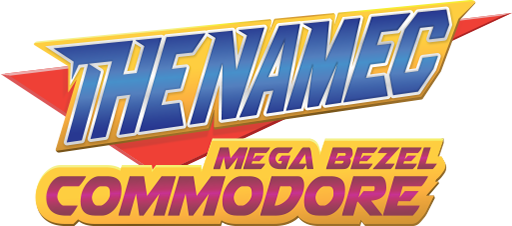

THENAMEC MEGA BEZEL : COMMODORE
==============================
  
All-in-one overlays and preset pack for **Libretro RetroArch** and **HSM Mega Bezel Reflection Shader**.  

Official Links:  
- *RetrogamingPacks Blog* <https://retrogamingpacks.blogspot.com>  
- *Libretro thread* <https://forums.libretro.com/t/31523>  
- *Facebook Page* <https://www.facebook.com/retrogamingpacks>  
- *YouTube Channel* <https://www.youtube.com/channel/UCnnDp1jwiNvSPlzzu2fW6vw>  
- *E-mail* <thenamec@hotmail.com>  

Latest releases:
- *Blog downloads* (https://retrogamingpacks.blogspot.com/p/downloads.html)  
- *GitHub Repository* <https://github.com/TheNamec/megabezel-commodore-pack/releases>

> Documentation revision  
> *October 2nd, 2022 - Release Candidate 4*

-------------------------------------------------------------------------------------

TABLE OF CONTENTS
=================
  
- [THENAMEC MEGA BEZEL : COMMODORE](#thenamec-mega-bezel--commodore)
- [TABLE OF CONTENTS](#table-of-contents)
- [OVERVIEW](#overview)
  - [A NOTE FROM THENAMEC](#a-note-from-thenamec)
  - [WHAT'S IN THE BOX](#whats-in-the-box)
- [FEATURES](#features)
  - [ORIGINAL ARTWORKS](#original-artworks)
  - [ZERO-CONFIG PRESETS](#zero-config-presets)
  - [CONNECT SCENES WITH DEVICES](#connect-scenes-with-devices)
  - [PRESET FLAVOURS](#preset-flavours)
    - [MBZ VANILLA FLAVOUR](#mbz-vanilla-flavour)
    - [NMC SPICED FLAVOUR](#nmc-spiced-flavour)
  - [LIGHTNING SYSTEM](#lightning-system)
    - [DEVICE LIGHTNING](#device-lightning)
    - [SCENE LIGHTNING](#scene-lightning)
  - [DEVICE CURVATURE](#device-curvature)
  - [DEVICE DISTANCE](#device-distance)
  - [DEVICE CRT MASK](#device-crt-mask)
  - [DEVICE SIGNAL/CONNECTION](#device-signalconnection)
  - [DEVICE COLOR-CORRECTION](#device-color-correction)
    - [TEMPERATURE SIMULATION](#temperature-simulation)
    - [MONOCHROME SIMULATION](#monochrome-simulation)
  - [PRESETS PERFORMANCE](#presets-performance)
  - [CUSTOM INTRO SEQUENCES](#custom-intro-sequences)
- [QUICK START](#quick-start)
  - [MINIMUM REQUIREMENTS - VERY IMPORTANT](#minimum-requirements---very-important)
  - [INSTALLATION](#installation)
    - [STEP 1: INSTALL RETROARCH](#step-1-install-retroarch)
    - [STEP 2: SETUP RETROARCH FOR MEGA BEZEL - VERY IMPORTANT](#step-2-setup-retroarch-for-mega-bezel---very-important)
    - [STEP 3: INSTALL MEGA BEZEL REFLECTION SHADER](#step-3-install-mega-bezel-reflection-shader)
    - [STEP 4: INSTALL THENAMEC MEGA BEZEL PACK](#step-4-install-thenamec-mega-bezel-pack)
    - [STEP 5: (OPTIONAL) SETUP FINALBURN NEO CORE](#step-5-optional-setup-finalburn-neo-core)
    - [STEP 6: (OPTIONAL) INSTALL COMMODORE CORES](#step-6-optional-install-commodore-cores)
  - [LOADING PRESETS](#loading-presets)
- [CUSTOMIZATION](#customization)
  - [BEFORE YOU START - VERY IMPORTANT](#before-you-start---very-important)
  - [CUSTOMIZE VIA QUICK MENU](#customize-via-quick-menu)
  - [CUSTOMIZE VIA DESKTOP MENU](#customize-via-desktop-menu)
  - [PRESETS SAVE/LOAD](#presets-saveload)
    - [MANUAL SAVE/LOAD](#manual-saveload)
    - [CORE PRESET](#core-preset)
    - [CONTENT DIRECTORY PRESET](#content-directory-preset)
    - [GAME PRESET](#game-preset)
  - [COMMON PER-GAME CUSTOMIZATIONS](#common-per-game-customizations)
    - [CUSTOMIZE DISPLAY SCALING AND POSITIONING](#customize-display-scaling-and-positioning)
    - [FIX OVERSCAN / PILLAR BOXES / BLACK AREAS](#fix-overscan--pillar-boxes--black-areas)
    - [SCENE LIGHTNING TUNING](#scene-lightning-tuning)
  - [ZERO-CONFIG PRESETS OVERRIDES](#zero-config-presets-overrides)
    - [LOCAL OVERRIDES](#local-overrides)
    - [GLOBAL OVERRIDES](#global-overrides)
- [FREQUENTLY ASKED QUESTIONS](#frequently-asked-questions)
  - [Q: How to install/update/uninstall TheNamec Mega Bezel Packs?](#q-how-to-installupdateuninstall-thenamec-mega-bezel-packs)
  - [Q: Vulkan, Glcore, Direct3D? Which video driver is better?](#q-vulkan-glcore-direct3d-which-video-driver-is-better)
  - [Q: Will Mega Bezel Reflection Shader work on ODroid, Raspberry Pi or - generally speaking - Single Board Computer?](#q-will-mega-bezel-reflection-shader-work-on-odroid-raspberry-pi-or---generally-speaking---single-board-computer)
  - [Q: Will Mega Bezel Reflection Shader work on my phone/tablet?](#q-will-mega-bezel-reflection-shader-work-on-my-phonetablet)
  - [Q: Will Mega Bezel Reflection Shader work on Xbox Series X/S?](#q-will-mega-bezel-reflection-shader-work-on-xbox-series-xs)
  - [Q: So TheNamec overlays just work on FullHD 1080p and UltraHD 2160p displays with 16:9 aspect ratio?](#q-so-thenamec-overlays-just-work-on-fullhd-1080p-and-ultrahd-2160p-displays-with-169-aspect-ratio)
  - [Q: Can't see any preset in the shaders folder!](#q-cant-see-any-preset-in-the-shaders-folder)
  - [Q: Everything looks stretchy and I see black pillar-boxes on sides! What the hell?](#q-everything-looks-stretchy-and-i-see-black-pillar-boxes-on-sides-what-the-hell)
  - [Q: Is TheNamec involved in Mega Bezel Project?](#q-is-thenamec-involved-in-mega-bezel-project)
  - [Q: What did you use to draw the artworks?](#q-what-did-you-use-to-draw-the-artworks)
  - [Q: Which CRT shader are presets based upon?](#q-which-crt-shader-are-presets-based-upon)
  - [Q: Will you improve TheNamec Mega Bezel Commodore ?](#q-will-you-improve-thenamec-mega-bezel-commodore-)
  - [Q: Will you ever expand beyond Commodore systems?](#q-will-you-ever-expand-beyond-commodore-systems)
  - [Q: Will you ever accept requests?](#q-will-you-ever-accept-requests)
- [POLICIES](#policies)
  - [TERMS AND CONDITIONS](#terms-and-conditions)
    - [DISTRIBUTION](#distribution)
    - [SOME RIGHTS RESERVED](#some-rights-reserved)
    - [REVISION CLAUSE](#revision-clause)
  - [DISCLAIMER](#disclaimer)
    - [THIRD-PARTY ASSETS](#third-party-assets)
    - [TRADEMARKS AND LOGOS](#trademarks-and-logos)
    - [LIMITATION OF LIABILITY CLAUSE](#limitation-of-liability-clause)
- [ACKNOWLEDGEMENTS](#acknowledgements)
  - [MEGA BEZEL COMMUNITY](#mega-bezel-community)
  - [CRT GAMING REDDIT COMMUNITY](#crt-gaming-reddit-community)
  - [PERSONAL THANKSGIVING](#personal-thanksgiving)
- [CONTACTS](#contacts)
  
OVERVIEW
=========

A NOTE FROM THENAMEC
-----------------------

Modern emulation evolves relentlessly. As creators, our ambition is to enhance your Retro Gaming experience beyond simple nostalgia, bringing back dormant memories and that familiar “I’ve been there, eons ago” mood.  

**TheNamec Mega Bezel Packs** revise the connection between the gamer and the original hardware: ***gameplay is the king*** but... when it comes to subtle details, pixels still enchant me.

I'm an Italian graphic artist and this is my love letter to the games of my youth: an overlays collection tributing Commodore hardware ranging from early '80s to late '90s.

WHAT'S IN THE BOX
-----------------------

SCENES AND BACKGROUNDS
- **Commodore Amiga series**: A1000, A500, A500 Plus, A600, A600HD, A1200, A1200Synth, Amiga CD32, CDTV
- **Commodore 64 series**: Silver Label, Breadbin, G Series, ALDI, DreanComm
- **Commodore VIC20 series**: Golden Label, Mark2, Mark3, VIC-1001
- **Commodore 264 Series**: Commodore16

DEVICES, DISPLAYS, MONITORS, TV
- **Commodore Monitors**: C1080, C1201 Monochrome, C1702, C1902, C1084, C1084S-D1, C1084S-D2 CDTV Black
- **Consumer CRT TVs**: Philips 21PT3326-V7
- **Dynamic Bezels**: Cream, Beige, Black, Dark-Gray

OTHER PERIPHERALS
- **Disk drives**: Internal Chinon FB-354 (A500/600/1200), External A1010 (A1000), External CD1411 (CDTV)
- **CD-ROM**: Proprietary MKE  drive (CD32)
- **Drive Simulator**: GoTek-like interface, LCD display, multi-floppy, SD-card and USB  (A1200Synth)
- **Datassette**: 1530 C2N, 1530 C2N-B (C64, VIC20)
- **Datassette**: DC-120 DreanComm (C64 DreanComm)
- **Datassette**: 1531 (C264 series)

FEATURES   
============

Here's an rundown of what you can expect from TheNamec Mega Bezel Packs.

ORIGINAL ARTWORKS
----------------------------

I personally draw my digital illustrations with a particular care for accessibility, usability and originality of concepts and design, while keeping quality at a professional level.

- Original vector illustrations based on actual hardware, advertising and manuals
- Remixed elements and screen optimization (ever dreamt about integrated data units?)
- FullHD 1080p and UltraHD 2160p resolutions, 16:9 aspect ratio, horizontal
- Adaptive support for ultrawide displays and alternative aspect ratios, including 16:10 and 4:3
- Bicubic sharper resampling from 300dpi to 72dpi for crispy, super-sampling anti-aliased visuals

Special "visual mods" are included to enhance retrogaming experience:
- `DATASSETTE LIGHTBULB` incandescent light over your audiocassette
- `EMBEDDED DATA DEVICE` compact, all-in-one design embeds disk drives and datassettes in the chassis
- `AMIGA 1200SYNTH` concept for a futuristic cyberpunk Amiga, equipped with a dark chassis, backlit keyboard, embedded multi-floppy data simulator and optical disk drive

ℹ️ *Note: `AMIGA 1200SYNTH` is also available in [**TheNamec FS-UAE Themes**](https://retrogamingpacks.blogspot.com/p/features-fs-uae-amiga-themes.html) pack for FS-UAE emulator, sporting some unique features:Blinking LED indicators, Functional multi-floppy data simulator, Disk presence switches, track display, access notification, Audio indicator, Basic curvature and scanlines postprocessing effects.*

ZERO-CONFIG PRESETS
-------------------------

**TheNamec Mega Bezel Packs** vision is to ***"make enhanced retrogaming accessible to everyone"***.

`PRESETS` fuse many elements to expose the full potential of enhanced retrogaming: artworks for scene and devices, lightning, CRT shader post-processing are just some examples of what's roaring under the hood. A huge effort was invested in designing thousands of **ready-to-go presets that require no user-side setup**.

The preset catalogue makes you choose the components of your scene step-by-step:
1) You choose your `SCENE` or background
2) You add a `DEVICE` being a Monitor, a TV, or a Dynamic Bezel
3) You select a `SHADER` to determine simulated CRT characteristics and effects (i.e. sharp, soft, smooth)
4) Finally set `PREFERENCES`, down to your personal gaming habits:  
~~~~
> 💭 How distant would you (ideally) sit from simulated device?
~~~~
~~~~
> 💭 Would you like your device to have a flat or curved tube? 
~~~~
~~~~
> 💭 Is it a "daily" or "nightly" lit scene? 
~~~~

Combination of these few elements alone determines a **terrific share of possibilities** for you to explore.

CONNECT SCENES WITH DEVICES 
----------------------

In **TheNamec Mega Bezel Commodore** each scene can be "connected" to each Monitor, TV and Dynamic Bezel available in the preset catalogue, building up incredible variety. Gotta test 'em all to find your perfect combo!

The concept came from IRL Commodore hardware being widely cross-platform compatible, meaning you can mix devices and systems spanning over 20 years of manufacturing.

ℹ️ *Note: In the days I used a C1084 monitor on Amiga 500, while lots of people used it as an high-end monitor for Commodore64. Nowadays C1702 Monitor is considered among "holy grails" of CRT gaming and can be connected to lots of gaming consoles via S-Video split Luma/Chroma inputs. Commodore was beyond!*

PRESET FLAVOURS
--------------------------

`PRESET FLAVOURS` enhance pixel visuals and take care of aging art styles like vectors and low-res illustrations. **TheNamec Mega Bezel Commodore** includes two presets kits:
- `MBZ VANILLA FLAVOURS` for HyperSpaceMadness default Mega Bezel Reflection Shader flavours
- `NMC SPICED FLAVOURS` for TheNamec enhanced flavours with additional visual layers

Each kit comes with its own variants split in two main families:
- `SHARP` for a modern take on a clear "pixel-art" with visible pixels
- `SOFT` for a more genuine smoothness, as probably meant by original artists working on original hardware.

### MBZ VANILLA FLAVOUR
*********************************

The kit defaults to the same experience included in Mega Bezel Reflection Shader base presets by HyperSpaceMadness: an ideal, near to perfect bright and clean CRT focused on gameplay.

Visual layers are disabled, meaning you will get  visuals with no `CRT MASK`, `SIGNAL/CONNECTION`, `COLOR-CORRECTION` and `LIGHTNING` simulations.

| Preset flavour                | Base Shader               |Mask     | Signal  | Color |Lightning|
|-------------------------------|:-------------------------:|:-------:|:-------:|:-----:|:-------:|
|`MBZ SHARP ADVANCED`           |mbz_1_adv_gdv              |NO       |NO       |NO     |VANILLA  |
|`MBZ SHARP LCD-GRID`           |mbz_1_adv_lcd-grid         |NO       |NO       |NO     |VANILLA  |
|`MBZ SHARP POTATO`             |mbz_5_potato_gdv           |NO       |NO       |NO     |VANILLA  |
|`MBZ SHARP SMOOTH ADVANCED`    |mbz_0_smooth-adv_gdv       |NO       |NO       |NO     |VANILLA  |
|`MBZ SHARP STANDARD`           |mbz_3_std_gdv              |NO       |NO       |NO     |VANILLA  |
|`MBZ SOFT NTSC ADVANCED`       |mbz_1_adv_gdv-ntsc         |NO       |NTSC     |NO     |VANILLA  |
|`MBZ SOFT NTSC POTATO`         |mbz_5_potato_gdv-ntsc      |NO       |NTSC     |NO     |VANILLA  |
|`MBZ SOFT NTSC SMOOTH ADVANCED`|mbz_0_smooth-adv_gdv-ntsc  |NO       |NTSC     |NO     |VANILLA  |
|`MBZ SOFT NTSC STANDARD`       |mbz_3_std_gdv-ntsc         |NO       |NTSC     |NO     |VANILLA  |

ℹ️ *Note: Monochrome devices will stay color-corrected on MBZ VANILLA FLAVOUR presets. NTSC vanilla presets may apply a custom CRT-MASK.*

### NMC SPICED FLAVOUR
*********************************

This is where things get hot 'n spicy. This kit enables visual layers with advanced `CRT MASK`, `SIGNAL/CONNECTION`, `COLOR-CORRECTION` and `LIGHTNING` simulations. It's a rad change that introduces lots of effects, resulting in "realistic-like" visuals and lots of additional elements both on-screen and off-screen. It may take a couple of minutes for you to absorb the sensory overload!

| Preset flavour                | Base Shader               |Mask     | Signal  | Color |Lightning|
|-------------------------------|:-------------------------:|:-------:|:-------:|:-----:|:-------:|
|`NMC SHARP RGB`                |mbz_1_adv_gdv              |YES      |RGB      |WARM   |ADVANCED |
|`NMC SHARP S-VIDEO`            |mbz_1_adv_gdv-ntsc         |YES      |S-VIDEO  |WARM   |ADVANCED |
|`NMC SHARP SMOOTH SCALEFX`     |mbz_0_smooth-adv_gdv       |YES      |RGB      |WARM   |ADVANCED |
|`NMC SOFT COMPOSITE`           |mbz_1_adv_gdv-ntsc         |YES      |COMPOSITE|WARM   |ADVANCED |
|`NMC SOFT RGB`                 |mbz_1_adv_gdv              |YES      |RGB+GTU  |WARM   |ADVANCED |
|`NMC SOFT RGB SMOOTH`          |mbz_0_smooth-adv_gdv       |YES      |RGB+GTU  |WARM   |ADVANCED |
|`NMC SOFT SMOOTH SUPER-XBR`    |mbz_1_adv_super-xbr_gdv    |YES      |NO       |WARM   |ADVANCED |
|`NMC SOFT UPSCALE DREZ 480p`   |mbz_1_adv_drez-480p_gdv    |YES      |NO       |WARM   |ADVANCED |
|`NMC SOFT VECTOR`              |mbz_vector-horizontal_std  |YES      |NO       |WARM   |ADVANCED |
|`NMC SOFT WORN-OUT`            |mbz_1_adv_gdv-ntsc         |YES      |RF-MOD   |WARM   |ADVANCED |

Spiced presets focus on signal/connection simulation:
- `NMC SHARP RGB` top quality for computer monitors, idealistic crystal clear
- `NMC SHARP S-VIDEO` really good quality for consumer TVs connection, minor bleeding
- `NMC SOFT RGB` upper class TVs connection, realistic high definition
- `NMC SOFT COMPOSITE` Standard quality for consumer TVs connection, moderate artifacts
- `NMC SOFT WORN-OUT` simulates RF on Channel 3-4, poor quality, visible artifacts, hum bar. Use with caution, a prolonged exposition will end up damaging your retinas.

Spiced presets also take care of specific art-style scenarios and may work xharms (or disasters) depending on games art types and core settings:
- `NMC SHARP SMOOTH SCALEFX` produces modern hi-res visuals with real-time filters including: ScaleFX smooth resample, fast sharpen, de-dithering and pseudo-transparencies.
- `NMC SOFT RGB SMOOTH SUPER-XBR` adds real-time filter to enhance 2D visuals. Post-processing produces antialiased 2D game artworks, while maintaining authentic CRT texture and a little graininess.
- `NMC SOFT UPSCALE DREZ 480p` works by rendering games at higher-than-native resolution (core settings) and then downscaling back to 480p to obtain a unique crisp/antialiased image. Best suited for early 3D games and 2D/3D mixing games to better blend muddy textures and ultra-sharp polygons.
- `NMC SOFT VECTOR` is specific for those early wireframe games like Lunar, Asteroids, Star Wars and the entire Vectrex library. Kind of a neon look, with bloom, a subtle low refresh flicker and a visible grid on screen. Gel color profile will inject some life in black/white classics.

ℹ️ *Note: DREZ presets requires cores options set to upper-than-480p resolution. When available use Cores Supersampling option, as it may give better performances and visual quality than DREZ shader.*

ℹ️ *Note: VECTOR presets performs much nicer with HIGH RESOLUTION or ANTIALIASED geometries. Refer to [setup FinalBurn Neo Core](#step-5-optional-setup-finalburn-neo-core) section and to documentation for Cores supporting **internal resolution multiplier** feature.*

LIGHTNING SYSTEM
-----------------------

**TheNamec Mega Bezel Commodore** features advanced lightning to give overlays a superior realistic vibe.  Presets come with day and night variants so you can instantly choose the best solution in a snap. Let your retrogames shine! 

### DEVICE LIGHTNING
*********************************

- `TUBE DIFFUSE IMAGE` adds a realistic dark grayish image of CRT tube behind actual game pixels instead of flat black
- `TUBE STATIC REFLECTION IMAGE` adds a shine on the tube which imitates reflection from the environment
- `TUBE SHADOW` the prominent bezels cast a shadow on tube from top
- `CABINET GLASS` brings extra details to the tube area, like scratches or reflections
- `DECAL IMAGE` becomes a LED lightmap for device details

### SCENE LIGHTNING
*********************************

- `DAY LIGHTNING` makes you enjoy a full lit room showing all accurately rebuilt graphics details
- `NIGHT LIGHTNING` is easier on your eyes as it simulates a soft, warm lit room
- `LEDs` brings lot of light emitting details particularly visible with soft lights

ℹ️ *Note: [`NMC SPICED FLAVOUR` presets](#nmc-spiced-flavour) enables full lightning system automatically. [`MBZ VANILLA FLAVOUR` presets](#mbz-vanilla-flavour) still have Day/Night alternatives, but without extra fancy effects. The latter will feel easier on your eyes.*

DEVICE CURVATURE
-----------------------

Modern FLAT device, or classic CURVED shapes? A pretty divisive topic in retrogaming community. 

Curvature brings undeniable magic, but also comes with shortcomings like distortion, moirè fringes, scanlines artifacts, and the infamous rainbow effect. FLAT screens were a much desired and expensive top range solution, but missed that vintage feeling. In the end, everything comes to undisputable personal testes. And everchanging mood.

`ZERO-CONFIG PRESETS` give you three alternatives:

~~~~
> 💭 Do you like your game having a little spherical distortion and wide reflective bezels?
~~~~
- `CURVED` simulates the typical barrel/spherical distortion from CRT surface. May introduce artifacts.  
  
~~~~
> 💭 You used to play on a flat screen with no distortion and little to no bezels? 
~~~~
- `FLAT` straightens things out like modern panels, making pixels perfectly orthogonal. No artifacts at all.

~~~~
> 💭 You'd like to have no distortion, yet keep wide bezels with reflections?
~~~~
- `FAUX-CURVED` mixes curved bezels and wide reflections with plain projection. A win-win balance of vintage and modern gaming.

DEVICE DISTANCE
----------------------

Retrogaming Packs come with zero-config presets for you to enjoy the most comfortable framing: textures layers logic will automatically take care of resizing for the best gaming experience.

`ZERO-CONFIG PRESETS` give you three alternatives:

~~~~
> 💭 Do you like playing with your nose touching the display, yet you'd like to see a little device?
~~~~
- `NEAR` is a hand-tuned sweet spot between gaming area and a zoomed-in display. Ideal solution for casual gaming.

~~~~
> 💭 Are you a 'coach gamer' who likes to see the scene from far, fully modeled with details?
~~~~
- `FULL DEVICE` trades a smaller gaming area for a beautiful simulated gaming setup. Best for nostalgic people.

~~~~
> 💭 You'd like to have biggest possible gaming area with clearest pixels?
~~~~
- `INTEGER SCALING` automatically adjust zoom to get native pixels and zero artifacts. Suitable for purists.

DEVICE CRT MASK
----------------------

What's a `CRT MASK`, you say? In real life color CRT displays used a metallic plate with tiny holes to "mask" phosphor cells, making them an easier target for Red, Blue and Green electron cannons. This produced sharper and cleaner images, at expense of a minor loss in brightness. Tiny holes (shadow-mask) where later followed by rectangular openings (slot-masks) and vertical wires (aperture-grille) resulting in ever increasing brightness and clarity.

**TheNamec Mega Bezel Commodore** includes four `CRT MASK` visual layers:
~~~~
> 💭 Do you like high quality Trinitron, DiamondTron and SonicTron series visuals?
~~~~
- `APERTURE-GRILLE`: [vertical phosphor stripes](https://en.wikipedia.org/wiki/Aperture_grille) top quality brightness and sharpness

~~~~
> 💭 Do you like classic arcade displays and consumer CRT TVs visuals?
~~~~
- `SLOT-MASK`: staggered grid of red, green and blue phosphors used on most consumer displays

~~~~
> 💭 Do you like elder CRT TVs visuals with poor brightness?
~~~~
- `SHADOW-MASK`: [red, green and a blue phosphor "dots" arranged in a triad](https://en.wikipedia.org/wiki/Shadow_mask)

~~~~
> 💭 Do you like old tube glass with visible thick surface and no CRT masking?
~~~~
- `PLASMA` [subtle pattern of monochrome phosphor cells](https://en.wikipedia.org/wiki/Monochrome_monitor), a pretty unique experience

`CRT MASK` visual layer respects real life counterparts:

|Device model|CRT Mask|Profile|
|---|:---:|:---:|
|Commodore C1080|`SLOT-MASK`|Commodore|
|Commodore C1201|`PLASMA`|Monochrome amber|
|Commodore C1702|`SLOT-MASK`|Commodore|
|Commodore C1902|`SLOT-MASK`|Commodore|
|Commodore C1084|`SLOT-MASK`|Commodore|
|Commodore C1084S-D1|`SLOT-MASK`|Commodore|
|Commodore C1084S-D2|`SLOT-MASK`|Commodore|
|Philips 21PT3326-V7|`SLOT-MASK`|Consumer|
|Dynamic Bezels|`APERTURE GRILLE`|-|

ℹ️ *Note: [`NMC SPICED FLAVOUR` presets](#nmc-spiced-flavour) include `CRT MASK` visual layer. [`MBZ VANILLA FLAVOUR` presets](#mbz-vanilla-flavour) bypass it.*

DEVICE SIGNAL/CONNECTION
----------------------

In real life connection between system and display really has a dramatic impact on visual quality: think of all the RGB mods, transcoders and expensive cables we bought to bump up A/V fidelity and reduce interferences.

**TheNamec Mega Bezel Commodore** includes five visual layers for `SIGNAL/CONNECTION`:
- `GTU`: Gaussian-kernel TV Upscaler simulating blur, bleeding effects and color levels.
- `RGB/COMPONENT/SCART`: Best quality connection, sharp and crisp image
- `S-VIDEO/YC`: Good quality connection, clean image
- `COMPOSITE/CVBS`: Low quality connection, some interferences
- `RF-MODULATOR/CHANNEL3-4`: Worst quality connection, subtle hum-bar and noise

ℹ️ *Note: [`NMC SPICED FLAVOUR` presets](#nmc-spiced-flavour) include `SIGNAL/CONNECTION` visual layer. [`MBZ VANILLA FLAVOUR` presets](#mbz-vanilla-flavour) bypass it.*

DEVICE COLOR-CORRECTION
----------------------

Maybe I will (not) shock you: ***we've been emulating games with totally wrong colors for years***. Modern LCD/OLED use a LEDs matrix to produce ultra-bright, super-vivid, sometimes over-saturated colors. Old CRTs used cannons to shoot electrons at a phosphor-coated glass screen. Are colors reproduced by such abysmal different technologies the same? Nope. Not at all. Not even similar.

Is Super Mario Bros sky so violet? Nope, it's blue. Are Sonic brick tiles in Green Hill Zone so orange? Nope again, they're brown. Eyeball original hardware for further proofs and bear in mind some facts:
- Artists originally used professional CRT displays to color videogames graphics
- Videogame graphics were designed to be reproduced on consumer CRT displays
- Europe, USA and Japan used to have non-standardized settings for color temperatures
- Each CRT display behavior changes according to settings, age and hours of activity

Well, colors are discrete as they're coded in games. Problem is they are not "compensated" by CRT screen. Real-time color-correction to the rescue!

### TEMPERATURE SIMULATION
*********************************

**TheNamec Mega Bezel Commodore** gives you two choices for white point balancing:

~~~~
> 💭 Do you like to play NTSC-U and PAL games with vivid colors?
~~~~
- `TEMPERATURE WARM 6500k`: best suited for NTSC-U and PAL countries, white point shifted towards reds, saturated colors

~~~~
> 💭 Do you prefer those obscure NTSC-J only games or want to improve contrast and black depth?
~~~~
- `TEMPERATURE COLD 9300k`: best suited for NTSC-J countries, white point shifted towards blues, adds a slightly glacial mood

You can configure [global overrides](#global-overrides) to switch all presets to `TEMPERATURE COLD 9300k` or even totally disable color-correction without having to edit one-by-one.

ℹ️ *Note: all of [`NMC SPICED FLAVOUR` presets](#nmc-spiced-flavour) default to `TEMPERATURE WARM 6500k` visual layer. [`MBZ VANILLA FLAVOUR` presets](#mbz-vanilla-flavour) bypass color-correction.*

### MONOCHROME SIMULATION
*********************************

My infamous [Monochrome Experience quest](https://retrogamingpacks.blogspot.com/2021/09/simulating-monochrome-experience.html) led to [almighty Guest.R building a `LUMA CONVERSION` feature](https://forums.libretro.com/t/new-crt-shader-from-guest-crt-guest-advanced-updates/25444/1518?u=thenamec) to share some love to firstborn CRTs. **TheNamec Mega Bezel Commodore** includes ***Commodore C1201***, a monochromatic monitor with amber phosphors, and additional switchable profiles:
~~~~
> 💭 Do you want to enjoy one-color gaming like you did on your IBM/Apple/Tandy/Nixdorf monitor or black and white TV?
~~~~
- `MONOCHROME AMBER`: P3 phosphor, light-orange tinting  
- `MONOCHROME BLACK&WHITE`: P4 phosphor, classic gray shades 
- `MONOCHROME GREEN`: P1 phosphor, Matrix terminal. ***Knock, Knock, Neo.***
- `MONOCHROME AQUA`: P2 phosphor, oscilloscope blue-green tinting
- `MONOCHROME BLOOD`: Virtual Boy edgy red tinting

ℹ️ *Note: `MONOCHROME` profiles are automatically applied accordingly to device model. You can experiment with additional profiles by customizing presets vwith [local overrides](#local-overrides).*

PRESETS PERFORMANCE
----------------------

Mega Bezel is optimized for a nice and consistent performance across SMOOTH-ADVANCED, ADVANCED or STANDARD presets. Nonetheless, POTATO provides accessibility for less powerful machines.

Here's a quick rundown of base shaders involved in **TheNamec Mega Bezel Commodore**:
- `ADVANCED (ADV)` is a full customizable experience with modular layouts for display scaling and positioning, glass reflections and ambient lightning. This is the way to go to have customization flexibility and performance, with high visual quality and unaltered original artworks
- `STANDARD (STD)` is a faster alternative to ADVANCED and includes CRT postprocessing effects like color grading and display scaling/positioning personalization 
- `POTATO (POT)` is an insanely performing overlay solution with easy-go CRT masking based on lighter shaders

~~~~
> 💭 Is the preset you like too heavy for your rig?
~~~~
  - Try toggling unwanted features and save your custom simple-presets
  - Just go for a POTATO preset, despite the naming it's incredibly tasty!

CUSTOM INTRO SEQUENCES
----------------------

Animated intro sequences will literally turn your device on while game is booting, full with old-school statics and a custom logo paired with each scene for a better immersion in retrogaming mood.

ℹ️ *Note: YOU MUST use RetroArch auto-loading methods to see custom intro sequences, please refer to the [loading presets](#loading-presets) section.*

QUICK START
===============
  
**TheNamec Mega Bezel Packs** are designed to be easy to pick up for RetroArch newcomers or veterans.

Follow the step-by-step [installation](#installation) instructions for a trouble-less quick start.

⚠️ *Please, please, PLEASE carefully read [requirements](#requirements---very-important-please-read), [before you start](#step-2-setup-retroarch-for-mega-bezel) and [frequently asked questions](#frequently-asked-questions) sections before asking for support.*

MINIMUM REQUIREMENTS - VERY IMPORTANT
---------------------------
  
To enjoy **TheNamec Mega Bezel Packs** you MUST have:
- [**RetroArch v1.11.0**](https://www.retroarch.com/?page=platforms)
- [**HSM Mega Bezel V_1.4.2_2022-09-27**](https://github.com/HyperspaceMadness/Mega_Bezel/releases)

INSTALLATION
------------------

### STEP 1: INSTALL RETROARCH
*************************************************

> 1) Install latest RetroArch  
> -> Download from [RetroArch official site](https://www.retroarch.com/?page=platforms)  
> -> Install according to your Operative System  

ℹ️ *Note: refer to detailed step-by-step instructions from Official Libretro Docs for [Frontend Installation](https://docs.libretro.com/) and [Cores Installation](https://docs.libretro.com/guides/download-cores/).

### STEP 2: SETUP RETROARCH FOR MEGA BEZEL - VERY IMPORTANT
*************************************************

IMPORTANT: these settings are required for Mega Bezel to work correctly.

Do this BEFORE loading your content
> 1) ***Configure video driver***  
> Launch RetroArch  
> Go to `Main Menu / Settings / Video / Output`  
> -> Set `Video` to `Vulkan` (best performance) or `GLCore` (if Vulkan is not available)

> 2) ***Enable advanced settings***  
> Go to `Main Menu / Settings / User Interface`  
> -> Set `Show Advanced Settings` to `ON`  

> 3) ***Configure video scaling***  
> Go to `Main Menu / Settings / Video / Scaling`  
> -> Set `Integer Scale` to `OFF`  
> -> Set `Aspect Ratio` to `FULL`  

> 4) ***Configure video rotation***  
> Go to `Main Menu / Settings / Video / Output`  
> -> Set `Video Rotation` to `NORMAL`  

> 5) ***Enable save config changes and restart***   
> Go to `Main Menu / Settings / Config`  
> -> Set `Save config on exit` to `ON`  
> Go to `Main Menu`  
> -> Do `Restart RetroArch`  

> 6) ***After restart, disable save config changes***    
> Go to `Main Menu / Settings / Config`  
> -> Set `Save config on exit` to `OFF`

  
### STEP 3: INSTALL MEGA BEZEL REFLECTION SHADER
****************************************************

Mega Bezel Reflection Shader should come already bundled in `Retroarch/shaders/shaders_slang/bezel/Mega_Bezel`.

If you can't find it or desire to update to latest version, there are different methods to get it: Online Updater, Manual Installing and GitHub Cloning.

ONLINE UPDATER (Easy)  
This is a fast and very easy way to install/update stable Mega Bezel releases from inside RetroArch
> 1) ***Update via RetroArch Online Updater***  
> Launch RetroArch    
> Go to `Main Menu / Online Updater`  
> -> Do `Update Slang shaders`  
> Wait for downloading... You'll get a notification when complete.  
> You're done!  

MANUAL INSTALLING (Intermediate)  
This is an alternative way to install/update stable Mega Bezel releases via .ZIP archive
> 1) ***Get latest release***  
> Download from [Mega Bezel GitHub Repo](https://github.com/HyperspaceMadness/Mega_Bezel/releases)  

> 2) ***Setup folders***  
> Navigate to `Retroarch/shaders/shaders_slang/` folder  
> -> If `bezel` folder is missing create it manually  

> 3) ***Install shader***
> Navigate to `Retroarch/shaders/shaders_slang/bezel/` folder  
> -> Copy `Mega_Bezel` folder from the downloaded .ZIP archive  
> -> Check final path to the Mega bezel being `Retroarch/shaders/shaders_slang/bezel/Mega_Bezel`  
> You're done!  

GITHUB CLONING (Advanced)  
This is a power-users method to install/update Mega Bezel development code via creating a local clone of Mega Bezel GitHub Repo. Remember Development code may be unstable/untested.  
> 1) ***Get and install GitHub Desktop latest release***  
> Download from [GitHub Desktop official site](https://desktop.github.com/)  
> Install using default settings  

> 2) ***Setup folders***  
> Navigate to `Retroarch/shaders/shaders_slang/` folder  
> -> If `bezel` folder is missing create it manually  
> Navigate to `Retroarch/shaders/shaders_slang/bezel/` folder  
> -> If `Mega_Bezel` folder is missing create it manually  
> Navigate to `Retroarch/shaders/shaders_slang/bezel/Mega_Bezel` folder  
> -> Verify `Mega_Bezel` folder to be empty (required for cloning)  

> 3) ***Install via GitHub Desktop***  
> Run GitHub Desktop  
> Open `File / Clone repository...`  
> Go to `URL` tab (rightest one)  
> -> In `URL or username/repository` input `HyperspaceMadness/Mega_Bezel`  
> -> In `Local path` do **choose...** and find your path to `RetroArch\shaders\shaders_slang\bezel\Mega_Bezel`  
> -> Do `CLONE`  
> Wait for downloading to complete...  
> You're done!  

For later updates straight from of Mega Bezel GitHub Repo  
> 4) ***Update via GitHub Desktop***  
> Run GitHub Desktop  
> Open `Current Repository` dropdown (top right)  
> -> Choose `Mega_Bezel`  
> -> Do `Fetch Origin`  
> Wait for downloading to complete...  
> You're done!  

  
### STEP 4: INSTALL THENAMEC MEGA BEZEL PACK
********************************************

There are two methods to get TheNamec Mega Bezel Packs: Manual Updating and GitHub Cloning.

MANUAL INSTALLING (Intermediate)
This is the ordinary way to install/update stable TheNamec Mega Bezel Packs releases via .ZIP file
> 1) ***Get latest release***  
> Download from [TheNamec Retropacks Blog](https://retrogamingpacks.blogspot.com/p/downloads.html)  
> (Direct) Download from [TheNamec GitHub Repo](https://github.com/TheNamec/megabezel-commodore-pack/releases)  

> 2) ***Setup folders***  
> Navigate to `Retroarch/shaders/` folder  
> If `Mega_Bezel_Packs` folder is missing create it manually  

> 3) ***Install pack***  
> Navigate to `Retroarch/shaders/Mega_Bezel_Packs` folder  
> Copy `TheNamec-Commodore`folder from the downloaded .ZIP archive  
> Check final path to the Mega bezel being `Retroarch/shaders/Mega_Bezel_Packs/TheNamec-Commodore`  
> You're done!  
      
GITHUB CLONING (Advanced)  
This is a power-users method to install/update TheNamec Mega Bezel Packs via creating local clones of TheNamec GitHub Repos  
> 1) ***Get and install GitHub Desktop latest release***  
> Download from [GitHub Desktop official site](https://desktop.github.com/)  
> Install using default settings  

> 2) ***Setup folders***  
> Navigate to `Retroarch/shaders/` folder  
> -> If `Mega_Bezel_Packs` folder is missing create it manually  
> Navigate to `Retroarch/shaders/Mega_Bezel_Packs` folder  
> -> If `TheNamec-Commodore` folder is missing create it manually  
> Navigate to `Retroarch/shaders/Mega_Bezel_Packs/TheNamec-Commodore` folder  
> -> Verify `TheNamec-Commodore` folder to be empty (required for cloning)  

> 3) ***Install via GitHub Desktop***  
> Run GitHub Desktop  
> Open `File / Clone repository...`  
> Go to `URL` tab (rightest one)  
> -> In `URL or username/repository` input `TheNamec/megabezel-commodore-pack`  
> -> In `Local path` do **choose...** and find your path to `Retroarch/shaders/Mega_Bezel_Packs/TheNamec-Commodore`  
> -> Do `CLONE`  
> Wait for downloading to complete...  
> You're done!  

For later updates straight from of TheNamec GitHub Repos   
> 4) ***Update via GitHub Desktop***  
> Run GitHub Desktop  
> Open `Current Repository` dropdown (top right)  
> -> Choose `megabezel-commodore-pack`  
> -> Do `Fetch Origin`  
> Wait for downloading to complete...  
> You're done!  

UNINSTALL THENAMEC MEGA BEZEL PACK  
> ***Uninstall pack***  
> Navigate to `RetroArch/shaders/Mega_Bezel_Packs/`  
> -> Delete `TheNamec-Commodore` folder  

### STEP 5: (OPTIONAL) SETUP FINALBURN NEO CORE
********************************************************

FinalBurn Neo core (arcade) needs special settings to work with Mega Bezels.

Do this BEFORE loading your content  
> 1) ***Configure RetroArch options***  
> Go to `Main Menu / Settings / Core`  
> -> Set `Allow Rotation` to `OFF`

Do this AFTER loading your content  
> 2) ***Configure FinalBurn Neo core options***  
> Go to `Quick Menu / Core Options`  
> -> Set `Vertical mode` to `OFF`  

If your game is VERTICAL  
> 2) ***Configure Mega Bezel shader options***  
> Go to `Quick Menu / Shaders / Shader Parameters`  
> -> Set `Rotate CRT Tube` to `1`  

If you game is UPSIDE-DOWN
> 3) ***Configure Mega Bezel shader options***  
> Go to `Quick Menu / Shaders / Shader Parameters`  
> -> Set `Flip Core Image Vertical` to `1`  
> -> Set `Flip Core Image Horizontal` to `1`  

If your game is VECTOR or WIREFRANE
> 2) ***Configure Core High Resolution output***  
> Go to `Quick Menu / Options / DIP Switches`  
> -> Set `Hires Mode` to `Yes`  

### STEP 6: (OPTIONAL) INSTALL COMMODORE CORES
********************************************************

RetroArch plays AMIGA, COMMODORE64 and VIC20 games via `cores` i.e. emulator plugins.
Cores installation is easily done from within RetroArch interface.

> 1) ***Install cores via Online Updater***
> Run RetroArch  
> Go to `Main menu / Online updater / Core Downloader`  
> -> Select [Commodore - Amiga (PUAE)](https://docs.libretro.com/library/puae/#core-options)  
> -> Select [Commodore - C64 (VICE x64, fast) or Commodore - C64 (VICE x64sc, accurate)](https://docs.libretro.com/library/vice/#c64-fastaccurate-specific)  
> -> Select [Commodore - VIC-20 (VICE xvic)](https://docs.libretro.com/library/vice/#vic-20-specific)  
> Wait for downloading. You will get notifications when complete...  
> You're done! 

ℹ️ *Note: AMIGA emulation requires copyrighted BIOS files with specific MD5 checksums. Please refer to [PUAE Core Docs](https://docs.libretro.com/library/puae/#bios) for more info and keep in mind: Google is your friend* 🔍  

ℹ️ *Note: you can use TheNamec Mega Bezel Packs with any Core, despite mismatching system and overlay. It would be rather sacrilegious to play a Mario Bros game on a Commodore64 setup, isn't it?* 👾
  
LOADING PRESETS
-------------------

You can easily load a pre-made preset for an hassle-free experience:

> 1) ***First run set-and-forget setup***
> Run RetroArch
> Load a content  
> Go to `Quick Menu / Shaders`
> -> Set `Video Shaders` to `ON`
> -> Set `Remember Last Used Shader Directory` to `ON`

> 2) ***Navigate to shader presets***  
> Go to `Quick Menu / Shaders / Load...`  
> Navigate to `Retroarch/shaders/Mega_Bezel_Packs/TheNamec-Commodore/Presets`  

> 3) ***Choose a `Scene folder`***  
> This configures backdrop image and lights, i.e. Amiga500 with power and drive LEDs.  
> Choose your preferred one.

> 4) ***Choose a `Device folder`***   
> This configures display image and lights, i.e. C1084 Monitor with function LED.  
> You can choose from:  
>     - Dynamic bezels, procedurally generated with automatic aspect ratio  
>     - Monitors and TVs, usually locked at standard 1.33 aspect ratio (4:3)  

> 5) ***Choose a `Shader folder`***  
> This controls games visuals via pixels post-processing.  
> You can select:
>     - MBZ vanilla presets from HyperSpaceMadness, featuring ideal clean visuals
>     - NMC spiced presets from TheNamec, featuring CRT masks, advanced lightning and color grading
>     - SHARP presets are clearer and crispier
>     - SOFT presets are blurrier and smoother

> 6) ***Choose a `.slangp Preset`***  
> Each preset combines variations described in the filename itself using tags.
> For further information check the Features section.
> Read tags as follows:
>     - **Screen Curvature**: Curved, Flat, Faux
>     - **Distance from screen**: Near, Full Device, Integer scaling
>     - **Ambient Lightning**: Day, Night  

> 7) ***Load the preset (finally!)***  
> Select a `.slangp` preset  
> Wait a couple seconds for the preset to load and... bam! You're done.  
> Got to `Quick Menu / Resume`  
> Enjoy enhanced gaming!  

> 8) ***Quick switch between presets (in the current folder)***  
> After loading a shader, you can use hotkeys for rapid scanning
>     - **Next preset**: press `M` key *(default settings)*
>     - **Previous preset**: press `N` key *(default settings)*
  
CUSTOMIZATION
=================

Mega Bezel really is the definitive swiss-knife when it comes to retrogaming experience customization. You can build tailor-made per-game customizations including:
- Fix overscan and centering for each game. Shame on you, lazy PAL/NTSC adaptions!
- Fiddle with display scaling, position and aspect ratio
- Tuning ambient and device lightning
- Invest countless hours in visual configuration (instead of happily gaming)

Let's discover how to accomplish these step-by-step.

BEFORE YOU START - VERY IMPORTANT
-----------------------------------------------

Shader Presets are combinations of one or more shaders. For simplicity, consider your customization as separate `child presets` that reference `parent presets`, the latters being presets included in TheNamec Mega Bezel Packs. This way your customized presets stay really simple, as they contain just the parameters you changed plus a reference to original preset. RetroArch refers to this mechanism as `Simple Preset` and introduces two critical advantages:
- Keeps `parent presets` intact (you really want that, to avoid having to reinstall if something goes wrong!)
- Outputs separate `child presets` for your customizations (way easier to maintain, fewer parameters)

ℹ️ *Note: For further reading on Simple Preset feature, check [Libretro Official Docs](https://docs.libretro.com/guides/shaders/#simple-presets).*

⚠️ *YOU MUST ENABLE `Simple Preset` to keep your customizations from destroying original presets.* 😰
> 1) ***Enable Simple Presets***  
> Go to `Quick Menu / Shaders / Save`  
> -> Set `Simple Presets` to `ON`  

CUSTOMIZE VIA QUICK MENU
------------------------------

`Quick menu` lets you customize via gamepad by increasing/decreasing values for shader parameters. It's ok for trivial changes, but can fell a little slow for complex activities and requires switching between the `quick menu` and gameplay are to see the changes.

ℹ️ *Note: unless you save your custom settings, you will lose all of them when you close the game or quit RetroArch!* 

> 1) ***First run set-and-forget setup***
> Launch RetroArch  
> Go to `Settings / User Interface / Appearance`  
> -> Set `Framebuffer Opacity` to around `0.300` (lower values = less opaque UI background)

> 2) ***Customize shader parameters via Quick Menu***
> Load your content  
> Go to `Quick Menu / Shaders / Shader Parameters / Parameters`  
> -> Adjust settings to your preference  

> 3) ***Test customized shader parameters in-game***  
> Go to `Quick Menu / Resume`  
> -> Enjoy playing or keep customizing  

> 4) ***Save customized preset***  
> Go to `Quick Menu / Shaders / Save`  
> -> Choose one saving option from pane (refer to [Loading presets](#loading-presets) section to determine best option)   

  
CUSTOMIZE VIA DESKTOP MENU
--------------------------------

`Desktop menu` lets you customize shader parameters via sliders and input boxes with mouse and keyboard. You can use side-by-side distinct game window and parameters panel and see the changes in real-time. `Desktop Menu` is the ideal tool to quickly learn parameters effects and to develop deep customizations.

ℹ️ *Note: unless you save your custom settings, you will lose all of them when you close the game or quit RetroArch!* 

> 1) ***First run set-and-forget setup***  
> Launch RetroArch  
> Go to `Settings / User Interface`  
> -> Set `Desktop Menu` to `ON`  
> Go to `Main Menu`  
> -> Do `Restart RetroArch` (required)  

> 2) ***Launch Desktop Menu***  
> Load your content (you better choose one without time limits 😉)  
> -> Press `f` key to exit full screen (***default settings***)  
> Go to `Window` pane  
> -> Select `Toggle Desktop Menu`  
> Desktop Menu window opens up  

> 3) ***Load shader via Desktop Menu***  
> Go to `View` pane  
> -> Select `Shaders`  
> Shaders Panel opens up  
> -> Select `Load` dropdown, choose `Load` again from pane  
> Navigate to the shader you want to customize  
> -> Select shader and do `Open`  
> Wait for shader to load  
> Shader panel gets populated with parameters  

> 4) ***Customize and live-test shader parameters via Desktop Menu***  
> Arrange **Shader panel** and **RetroArch content **window** side-by-side so you can easily see both  
> Adjust settings to your preference using sliders in Shader Panel  
> You can see changes updating in real time in RetroArch main window  

> 5) ***Save customized preset***  
> Go to Shaders Panel  
> -> Select `Save` dropdown
> -> Choose one saving option from pane (refer to [Loading presets](#loading-presets) section to determine best option)   

> 6) ***Close Desktop Menu***  
> Go to `File` pane in Desktop Menu  
> -> Select `Exit`  
> Desktop Menu will close.  

> 7) ***Re-enable full screen***  
> Focus RetroArch main window
> -> Press `f` key to enter full screen (***default settings***)  

PRESETS SAVE/LOAD
---------------------

RetroArch gives you different choices for automatically loading shaders so you don't have to manually select presets each time you load content. Do some experimentation and find the one that best fits your needs!

- `GLOBAL PRESETS` are automatically applied in any content for any core
- `CORE PRESETS` are applied in any content for that specific core
- `CONTENT DIRECTORY PRESETS` apply to all content in a certain folder
- `GAME PRESETS` apply just to one game

ℹ️ *Note: Content Directory preset and Game Presets are also core specific. For further reading about RetroArch shaders check [Libretro Official Docs](https://docs.libretro.com/guides/shaders/).*
  

### MANUAL SAVE/LOAD
**************************
~~~~
> 💭  Would you like to manually load a preset each time you launch a game?
~~~~

- PRO 👍
  - You are free to load whatever shader preset you like, regardless of game, core or path
- CON 👎
  - You have to reload the shader preset each time you start a content

> 1) ***Save your preset***  
> Go to `Quick Menu / Shaders / Save`  
> -> Select `Save Shader preset as...`  
> -> Input a name and confirm  
> Preset is saved. You will get a notification.  

> 2) ***Load your preset***  
> Go to `Quick Menu / Shaders / Load`  
> -> Navigate to your preset folder  
> -> Select a preset and confirm to open  
> Preset is saved. You will get a notification.  

ℹ️ *Note: Custom preset are saved in `/shaders` folder.*
  
### CORE PRESET
*******************************
~~~~
> 💭 Would you like to autoload presets each time you use a specific core (i.e. `PUAE core`)?
~~~~

* PRO 👍
  - RetroArch will load the same preset for all games using a specific core
* CON 👎
  - You can use ONE graphic pack for each core
  - I.e. PUAE Core, you can't have both AMIGA500 and AMIGA1200 presets autoloading

> 1) ***Save your preset***  
> Go to `Quick Menu / Shaders / Save`  
> -> Select `Save Core preset`  
> Preset is saved. You will get a notification.  

> 2) ***Load your preset***  
> Preset is automatically applied when you load content using a specific core.

ℹ️ *Note: Custom core presets are saved in `/config/CoreName/CoreName.slangp`.*
  
### CONTENT DIRECTORY PRESET
*********************************
~~~~
> 💭 Would you like to autoload the same preset for all games from a specific folder (i.e. `roms/Commodore - Amiga`)?
~~~~
- PRO 👍
  - RetroArch will load the same preset for ALL the games in a specific folder.
  - Usually this is the sweet spot to associate a different presets on a multi-system core.
  - I.e. PUAE core, three distinct folders for Amiga500, Amiga 1200 and Amiga CD32
- CON 👎
  - You can't have game-specific shader adjustments, i.e. overscan settings
  - You have to use separate core presets
  - You have to use separate game presets

> 1) ***Save your preset***  
> Go to `Quick Menu / Shaders / Save`  
> -> Select `Save Content Directory preset`  
> Preset is saved. You will get a notification.  

> 2) ***Load your preset***  
> Preset is automatically applied when you load content from a specific folder.

ℹ️ *Note: Custom directory preset are saved in `/config/CoreName/FolderName.slangp`.*
  
  
### GAME PRESET
*******************************
~~~~
> 💭 Would you like to autoload a specific preset for a single game?
~~~~
- PRO 👍
  - RetroArch will load a specific preset each time you boot a specific game.
  - You can tune the shader settings to perfection, including position and overscan, for each game. - You can choose different presets for each game.
- CON 👎
  - You'll have to do this for every-single-game-you-love.
  - Process is boring and time consuming. Yet oddly satisfying.

> 1) ***Save your preset***  
> Go to `Quick Menu / Shaders / Save`  
> -> Select `Game preset`  
> Preset is saved. You will get a notification.  

> 2) ***Load your preset***  
> Preset is automatically applied when you load content from a specific folder.  

ℹ️ *Note: Custom game preset are saved in the `/config/CoreName/GameName.slangp`.*

COMMON PER-GAME CUSTOMIZATIONS
---------------------------

This section contains some step-by-step examples of some of the most wanted per-game customizations. 

For the sake of brevity I will assume that you have already done these preliminary steps:
> 0) ***Before customizing***  
> Launch RetroArch  
> Load your content  
> Go to `Quick Menu / Shaders / Shader Parameters`

ℹ️ *Note: For more information about Mega Bezel parameters, please refer to the HSM Mega Bezel Reflection Shaders documentation.*

### CUSTOMIZE DISPLAY SCALING AND POSITIONING
*****************************************************

You can customize device scaling and positioning (not available for POTATO presets)

> 1) ***Customize display scaling***  
> Go to `SCALING` section  
> -> Set `NON-INTEGER SCALE %` to custom value  

> 2) ***Customize display positioning***  
> Go to `POSITION OFFSET` section  
> -> Set `POSITION X` and `POSITION Y` to custom value  

### FIX OVERSCAN / PILLAR BOXES / BLACK AREAS
*****************************************************

I know, I know. You always hated these huge black areas from old games. Consider these as a trick to overcome performance limitations and to do lazy PAL/NTSC conversions. Finally you can trim black areas to pursue your dream of an ideal ***full screen***: content will adapt accordingly in real-time.

Remember that ***Monitors/TVs presets*** are locked to 4:3, so you have to balance aspect ratio to prevent stretching. You will get the best results with ***Dynamic Bezels presets*** as they fluidly adapt to content changes and automatically adapt to keep aspect ratio.

ℹ️ *Note: Overscan tuning greatly changes from game to game, a perfect scenario for custom Game Presets.*

> 1) ***Customize overscan***  
> Go to `CROPPING` section  
> -> Set `CROP MODE` to `CROP ANY`  
> -> Set `CROP TOP %`, `CROP BOTTOM %`, `CROP LEFT %` and `CROP RIGHT %` to cut away pixels  

You can tune the lightning level for best contrast between gaming area and backdrop:

### SCENE LIGHTNING TUNING
*****************************************************

> 1) ***Customize ambient lightning***  
> Go to `NIGHT LIGHTNING` section  
> -> Set `OPACITY` value to set the amount of darkness  

ZERO-CONFIG PRESETS OVERRIDES
---------------------------

### LOCAL OVERRIDES
*****************************************************

ZERO-CONFIG PRESETS are modular, meaning you can enable/disable complex features just by editing single lines in the preset without messing with thousands of parameters.

This comes really hand to configure preset-level scenarios:
- SCENE LIGHTNING: `ADVANCED FX` (default), `VANILLA`
- DEVICE COLOR-CORRECTION: `TEMPERATURE` and `MONOCHROME` profiles

Customization is rather simple:  
- Lines starting with `#REFERENCE` are enabled  
- Lines starting with `DOUBLE SLASH` before the `#REFERENCE` are disabled  

> 1) ***Open PRESET***  
> Navigate to `Retroarch/shaders/Mega_Bezel_Packs/TheNamec-Commodore/Presets/Scene/Device/Shader/Preset.slangp`  
> Open `Preset.slangp` with your favorite text editor  

> 2) ***Customize LOCAL CONFIGURATION***  
> Add/remove 'DOUBLE SLASH' to enable/disable settings  
> Further instructions included in `preset.slangp`  
> Save when finished.  

Other visual layers switches are included FOR TESTING PURPOSE ONLY:
- SCENE BASE modules
- DEVICE SCALING profiles
- DEVICE CURVATURE profiles
- DEVICE CRT MASK profiles
- DEVICE CRT FLAVOUR modules

### GLOBAL OVERRIDES
*****************************************************

**TheNamec Mega Bezel Commodore** introduces a powerful `GLOBAL OVERRIDE` feature to manage effects across ALL `NMC SPICED FLAVOUR` presets without having to customize them one by one.

This comes really handy to configure general settings:
- DEVICE LIGHTNING: `TUBE DIFFUSE`, `TUBE REFLECTION STATIC`, `TUBE SHADOW`, `CABINET GLASS`
- COLOR-CORRECTION: `TEMPERATURE WARM` (default), `TEMPERATURE COLD`

Customization is rather simple:  
- Lines starting with `#REFERENCE` are enabled  
- Lines starting with `DOUBLE SLASH` before the `#REFERENCE` are disabled  

> 1) ***Open GLOBAL OVERRIDE***  
> Navigate to `Retroarch/shaders/Mega_Bezel_Packs/TheNamec-Commodore/res`  
> Open `overrides.params` with your favorite text editor  

> 2) ***Customize GLOBAL OVERRIDE***  
> Add/remove 'DOUBLE SLASH' to enable/disable settings  
> Further instructions included in `overrides.params`  
> Save when finished.  

Other visual layers switches are included FOR TESTING PURPOSE ONLY:
- DEVICE ASPECT RATIO: `AUTO` (default for Dynamic Bezels), `EXPLICIT 1.33` (default for monitors and TVs), `PAR PIXEL ASPECT RATIO`
- DEVICE CRT MASK profiles
- DEVICE SIGNAL/CONNECTION profiles
- DEVICE COLOR-CORRECTION monochrome profiles
- DEVICE CRT FLAVOUR modules

⚠️ *WARNING. With great power comes great responsibility! Use global overrides carefully to avoid unexpected results. Backup files to avoid having to reinstall the pack.* 😰

  
FREQUENTLY ASKED QUESTIONS
==============================
  
## Q: How to install/update/uninstall TheNamec Mega Bezel Packs?
* Please follow Quick Start instructions in the [Install TheNamec Mega Bezel Pack](#step-4-install-thenamec-mega-bezel-pack) section.

## Q: Vulkan, Glcore, Direct3D? Which video driver is better?
  * `Vulkan` is the king for performance. Full stop.
  * `Glcore` may work, but require longer compilation times at start and suffer bad performance.
  * `Direct3D` has extreme compilation times. Like... months.
  * Really, `Vulkan` is the way to go. If your device doesn't support it try using `Glcore`.

## Q: Will Mega Bezel Reflection Shader work on ODroid, Raspberry Pi or - generally speaking - Single Board Computer?
* Not yet. Mega Bezel can be somewhat intensive on CPU/GPU, the lack of supported drivers and computing firepower will inevitably compromise the gaming experience.
* Developer HyperSpaceMadness is constantly improving performance with optimizations like graphics caching and light shaders variants!

## Q: Will Mega Bezel Reflection Shader work on my phone/tablet?
* Of course, if you have enough computing firepower. And `Vulkan` support.
* Your last chance are `Potato` presets!

## Q: Will Mega Bezel Reflection Shader work on Xbox Series X/S?
* Not yet because of `Direct3D` having really poor performance with the shader.

## Q: So TheNamec overlays just work on FullHD 1080p and UltraHD 2160p displays with 16:9 aspect ratio?
* Nope. Presets really should work with any host scenario. **Except for vertical/rotated displays**.
* Responsive design adapts to ultrawide and other-than-16:9 displays, including 16:10 and 4:3.
* To me, FullHD and UltraHD are a good balance of file size, performance and image quality.
* Vector artworks are future proof. I can upscale to infinite resolutions... if I only had infinite RAM!

## Q: Can't see any preset in the shaders folder!
* A video driver is compatible with `slangp` shader format is strictly required.
* Recommended video driver is `Vulkan`. Use `Glcore` if your device doesn't support it.
* Be sure to check the [Setup RetroArch for Mega Bezel](#step-2-setup-retroarch-for-mega-bezel) section for further info on driver setting.

## Q: Everything looks stretchy and I see black pillar-boxes on sides! What the hell?
* 99% of times this is related to missing RetroArch settings:
  * [Check RetroArch settings for Mega Bezel](#step-2-setup-retroarch-for-mega-bezel) 
  * [Check FinalBurn Neo settings for Mega Bezel](#step-5-optional-setup-finalburn-neo-core)
* Some other times it's because of out-of-date or incompatible software:
  * [Check software requirements](#requirements---very-important-please-read)
  * [Update RetroArch to latest version](#step-1-install-retroarch)
  * [Update Mega Bezel to latest version](#step-3-install-mega-bezel-reflection-shader)
  * [Update TheNamec Mega Bezel Packs to latest version](#step-3-install-thenamec-mega-bezel-pack)

## Q: Is TheNamec involved in Mega Bezel Project?
* Yup yup, I'm a proud member of the collective of artists pushing boundaries for better Bezels since 2020!
* Be sure to check my comrades projects, links in [Mega Bezel Community](#mega-bezel-community) section.

## Q: What did you use to draw the artworks?
* A sperimental vector drawing application.
* A beated-up Logitech G502 mouse.
* No fancy graphic tablets were harmed during the process.
* Little to no raster post-production, except for 2160p to 1080p supersampling.

## Q: Which CRT shader are presets based upon?
* `crt-guest-advanced` and NTSC variants from [Guest.R](https://forums.libretro.com/t/25444)
* `lcd-grid` from CGCW

## Q: Will you improve TheNamec Mega Bezel Commodore ?
* Adding more Amiga, Commodore 64, VIC20 and Commodore 264 series variations and data units 🦾
* I'm pretty torn about pc-looking A1500, A2000, A3000, A4000... I'll take a look at these as soon as I complete the visual shaders overhaul 🤞

## Q: Will you ever expand beyond Commodore systems?
* Search for **TheNamec Mega Bezel CRT GAMING** pack. Pretty nice devices there!
* Free time and motivation really are key elements! 💪

## Q: Will you ever accept requests?
* Of course, if the subject is interesting in preserving videogaming history. 
* Obscure gaming devices are best candidates. Please propose in my [Libretro thread](https://forums.libretro.com/t/31523) and add some photos!
* I might not be interested in illustrating ordinary grandma's TV set of your youth. At least, not for free.

 
POLICIES 
========================

TERMS AND CONDITIONS
--------------------------
  
### DISTRIBUTION
************************

TheNamec Mega Bezel Packs can be downloaded from the **official website** <https://retrogamingpacks.blogspot.com> and **GitHub Repository** <https://github.com/thenamec/megabezel-commodore-pack>.

TheNamec Mega Bezel Packs and all its related assets and codes are free for personal use: if you paid for it, you have been scammed. 🤬
  
  
### SOME RIGHTS RESERVED
********************************

All the graphic assets, presets code and documentation from Retrogaming Packs are published under the `Attribution-NonCommercial-NoDerivatives 4.0 International Creative Commons license` (CC BY-NC-ND 4.0).

This includes **TheNamec Mega Bezel Commodore**, **TheNamec Mega Bezel CRT Gaming** and **TheNamec FS-UAE Themes** and was a necessary choice to block the use of my (hard) work in derivative projects with no respect for the attribution clause and without even notifying me.

Extract from 'CC BY-NC-ND 4.0' Commons Deed <https://creativecommons.org/licenses/by-nc-nd/4.0/deed.en>: 

> You are free to:
> - **Share** — copy and redistribute the material in any medium or format.
> 
> The licensor cannot revoke these freedoms as long as you follow the license terms.
> 
> Under the following terms:
> - **Attribution** — You must give appropriate credit, provide a link to the license, and indicate if changes were made. You may do so in any reasonable manner, but not in any way that suggests the licensor endorses you or your use.
> - **NonCommercial** — You may not use the material for commercial purposes.
> - **NoDerivatives** — If you remix, transform, or build upon the material, you may not distribute the modified material.
> - **No additional restrictions** — You may not apply legal terms or technological measures that legally restrict others from doing anything the license permits.

For further reading about the 'CC BY-NC-SA 4.0' legal code:
<https://creativecommons.org/licenses/by-nc-nd/4.0/legalcode.en>
  
  
### REVISION CLAUSE
***************************

The author may at any time revise these Terms and Conditions by updating this documentation. Users are bound by the most current Terms and Conditions every time they visit **official website** <https://retrogamingpacks.blogspot.com/> or **GitHub Repository** <https://github.com/thenamec/megabezel-commodore-pack>, therefore users should periodically review these Terms and Conditions to which they are bound.
  
   
DISCLAIMER 
----------------
  
### THIRD-PARTY ASSETS
******************************

This product includes textures developed by HSM Mega Bezel Reflection Shader.

This product includes both original and customized pixel shaders from scene contributors:
- `CRT-MASK :: SLOT-MASK COMMODORE` is based off 'CRT-A2080-HiResSmartResShader' by Guest.R & Rincewind <https://blog.johnnovak.net/2022/04/15/achieving-period-correct-graphics-in-personal-computer-emulators-part-1-the-amiga/>

I'd like to thank *Unsplash* community photographers for providing hi-quality source materials for textures:

- Annie Spratt <https://unsplash.com/@anniespratt>
- Bernard Hermant <https://unsplash.com/@bernardhermant>
- Carl Raw <https://unsplash.com/@carltraw>
- Diego Passadori <https://unsplash.com/@dipassadori>
- gryffyn m <https://unsplash.com/@botanicalnature>
- jeremy zero <https://unsplash.com/@jeremy0>
- Michael Dziedzic <https://unsplash.com/@lazycreekimages>
- Mitchell Luo <https://unsplash.com/@mitchel3uo>
- Mockaroon <https://unsplash.com/@mockaroon>
- SJ Objío <https://unsplash.com/@sjobjio>
  
Extract from 'Unsplash License' <https://unsplash.com/license> :

> Unsplash photos are made to be used freely. Our license reflects that.
>  
> - All photos can be downloaded and used for free
> - Commercial and non-commercial purposes
> - No permission needed
  

### TRADEMARKS AND LOGOS
********************************

All trademarks are included under the concept of 'nominative fair use' for informational, documentary and educational purposes and refer to the trademark owner’s goods and services associated with these marks. 

Commodore brand, including the 'C=', the 'C-flag logo', '64 and rainbow lines logo' and 'VIC20 and VC20 logo alternatives', is a registered trademark owned by Commodore Business Machines LTD.

Amiga brand, including the 'Amiga 1985 logo', 'Amiga 1996 logo', 'boing ball logo', 'slanted A logo', 'tick logo' and 'Amiga CD32 logo', is a registered trademark owned by Amiga Corporation.

All other Trademarks and logos or registered Trademarks and logos used or mentioned belong to their respective owners.

All Trademarks and logos used or mentioned belong to their respective owners.
  
### LIMITATION OF LIABILITY CLAUSE
******************************************

Under no circumstances will the author be held responsible or liable in any way for any claims, damages, losses, expenses, costs or liabilities whatsoever (including, without limitation, any direct or indirect damages for loss of profits, business interruption or loss of information) resulting or arising directly or indirectly from your use of or inability to use this software or any websites linked to it.

ACKNOWLEDGEMENTS 
====================

MEGA BEZEL COMMUNITY
--------------------------

HyperSpaceMadness `Mega Bezel Reflection Shader` is an impressive real-time postprocessing framework simulating CRT technology features while mitigating its worst, obsolete defects. The framework integrates tools from Guest.R, CRT-Geom Deluxe, LCD-GRID and has some never-seen-before original features like dynamic procedural bezels, real-time reflections, ambient illumination and the unique GLASS visuals.

More info on HyperSpaceMadness `Mega Bezel Reflection Shader` project at [Official website](https://megabezel.com/), [GitHub Repo](https://github.com/HyperspaceMadness/Mega_Bezel) and [Libretro Forums](https://forums.libretro.com/t/25512).

Many artists decided to experiment with Mega Bezel, leading to a creative community with shared ideals and design principles. I'd like to thank my fellows in this pixelated voyage for providing a continuous stream of inspiration, cool ideas and technical knowledge:
  * **Duimon** made an incredible effort with his [encyclopedic gaming systems project](https://forums.libretro.com/t/28146)
  * **Soqueroeu** produces [console-themed TV Sets](https://forums.libretro.com/t/34301)
  * **Orionsangel** focuses on [game-themed arcade cabinets](https://forums.libretro.com/t/10604)
  * **MajorPainTheCactus**'s Megatron provides [highly accurate CRT simulations](https://forums.libretro.com/t/36109)
  * **CyberLab** revived [Death to Pixels shaders and perfected additional filters](https://forums.libretro.com/t/35606)

CRT GAMING REDDIT COMMUNITY
----------------------------------

Can't recommend [r/crtgaming subreddit](https://www.reddit.com/r/crtgaming/) enough to get your feet wet in cathodic tubes applied to retro and modern gaming!

People from **r/crtgaming** is an precious source of information about CRT tech insights, visual references and detailed photos. They supported development of **TheNamec Mega Bezel CRT Gaming** pack since early days with lots of responsive feedback, suggestions and a stellar device selection to help me find the Holy Grails of CRT Gaming.

I'd like to kindly thank u/Hudson_bee for providing me high-quality closeups of his JVC DT-V1710.

PERSONAL THANKSGIVING
---------------------------

I'd like to thank people who supported me in the project:

- My father Rocco, for introducing me in Commodore computers gaming at the age of four
- My girlfriend Sabrina for supporting me in doing something funny, just for fun sake
- HyperSpaceMadness for his impressive shader and near-daily support
- The Mega Bezel Community for setting such excellent design quality standards

CONTACTS 
==============
  
TheNamec Retrogaming Packs is a fluid project: since the beginning, I tried to add the coolest features that came up to my mind and the requested ones from the retrogaming community.  

Please refer to the project network to share ideas and comments:

Official Links:  
- *RetrogamingPacks Blog* <https://retrogamingpacks.blogspot.com>  
- *Libretro thread* <https://forums.libretro.com/t/31523>  
- *Facebook Page* <https://www.facebook.com/retrogamingpacks>  
- *YouTube Channel* <https://www.youtube.com/channel/UCnnDp1jwiNvSPlzzu2fW6vw>  
- *E-mail* <thenamec@hotmail.com>  

Latest releases:
- *Blog downloads* (https://retrogamingpacks.blogspot.com/p/downloads.html)  
- *GitHub Repository* <https://github.com/TheNamec/megabezel-commodore-pack/releases>